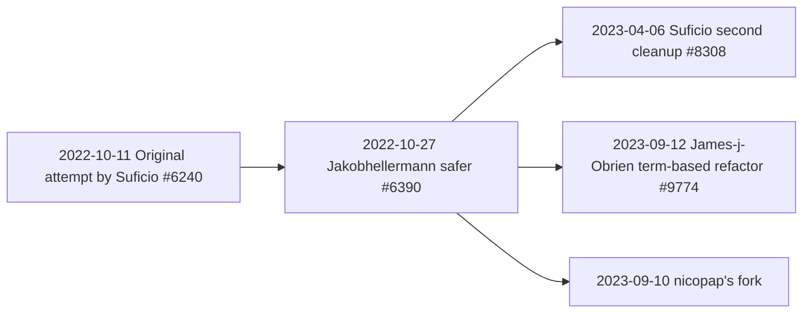

# 理解 bevy 的 `Query` 以及动态查询

动态查询是 Bevy `Query` 系统的扩展。

<details markdown="1"><summary>原文</summary>

Dynamic query is an extension of the bevy `Query` system.

</details>

## `Query` 的工作原理

首先，我们需要理解 `Query` 的工作方式，才能体会动态查询的意义所在。

<details markdown="1"><summary>原文</summary>

First, we need to understand how `Query` works to understand the interest of dynamic queries.

</details>

基础 `Query` 依赖类型来生成一组指令，这些指令会创建指向 ECS 中存储数据的指针，并将这些指针转换为查询类型对应的 Rust 引用。

<details markdown="1"><summary>原文</summary>

The base `Query` rely on types to create a set of instructions that will create pointers to data stored in the ECS. Those pointers are converted into rust references of the type of the query.

</details>

`Query` 依赖 [`WorldQuery`] trait 来生成这组指令。`WorldQuery` 拥有许多方法，这些方法被用于[查询迭代][query iteration]和[查询初始化][query initialization]的代码中。在 [`WorldQuery` 的各类实现][`WorldQuery` implementations]中，你会发现大多数方法要么被实现为一个简单的常量，要么根本没有任何代码。这一点非常重要——每当你编写一个具体的 `Query`（例如 `Query<&Transform, With<FooBar>>`）时，这些方法的具体代码（通常只是极短的片段或常量）就会被内联到所有使用 `WorldQuery` 方法的地方（即初始化和迭代代码）。你看到的代码表面上可能相当复杂、难以理解，但编译器实际看到的却是极为简单的代码。正因为代码足够简单，编译器才能进行十分出色的优化。最终生成的汇编代码看起来非常接近经典的 `for` 循环！

<details markdown="1"><summary>原文</summary>

`Query` relies on the [`WorldQuery`] trait to create the set of instructions. `WorldQuery` has a lot of methods. Those methods are used in [query iteration] and [query initialization] code. In the [`WorldQuery` implementations], you'll notice that most of those methods are implemented as a simple constant, or no code at all. This is important, because whenever you write an actual "concrete" `Query` (for example `Query<&Transform, With<FooBar>>`) the methods concrete codes (which are very small snippets or constants) will be inserted wherever the methods of `WorldQuery` are used (the initialization and iteration code). You may see relatively complex and difficult to grok code, but the compiler actually sees simple code. With simple code, the compiler is capable of doing very good optimizations. In the end, the generated assembly code looks very close to a classic `for` loop!

</details>

### 原型（Archetypes）

要进一步理解 `WorldQuery` 的实现，你必须先了解 ECS 是如何实现的。

<details markdown="1"><summary>原文</summary>

To further understand `WorldQuery` implementations. You have to understand how the ECS is implemented.

</details>

每个 `Entity` 都拥有一组给定的组件。所有拥有完全相同组件集合的实体被归入同一个"原型（Archetype）"。例如 `Query<(&Transform, &mut Sprite), With<Player>>` 这样的查询，在初始化时会计算出它需要访问的原型集合。在运行时，随着组件不断被添加或移除，新的原型会不断涌现，Bevy 也会相应地更新查询，使其能够覆盖这些新原型。

<details markdown="1"><summary>原文</summary>

Each `Entity` has a given set of components. All entities with the exact same set of components are gathered in a single "Archetype". A `Query` such as `Query<(&Transform, &mut Sprite), With<Player>>`, when initializing, computes the set of archetypes it needs to access. At runtime, as new components are added and removed from entities, new archetypes will show up, and bevy will also update the queries so that they can account for new archetypes.

</details>

查询所需遍历的原型以索引的形式存储在一个 `FixedBitset` 中。简而言之，这是一个由 0 和 1 组成的列表，其中值为 1 的位索引对应着查询需要访问的原型。

<details markdown="1"><summary>原文</summary>

The archetypes the query iterates over are stored by index in a `FixedBitset`. Basically, it's a bunch of 1s and 0s, in a list, and the bit index of 1s corresponds to an archetype the query must visit.

</details>

在遍历 `Query` 时，查询会通过 ID 取出单个原型。原型会告诉查询组件存储在哪里以及组件有多少个。`Query` 会遍历一个原型中的所有组件，当该原型被完全遍历后，再查找下一个原型，对其组件进行遍历，如此反复，直到没有更多原型可读为止。

<details markdown="1"><summary>原文</summary>

When iterating over a `Query`, the query will fetch by ID a single archetype. The archetype tells the query where the components are stored and how many of them there are. The `Query` will iterate over all components of an archetype, and when the archetype is fully iterated, it will look for the next archetype, iterate over the components of the next archetype, repeat until there is no more archetypes to read.

</details>

### `QueryState`

收集原型是一项开销较大的操作，因此会通过 `QueryState` 结构体进行"缓存"（这个说法在 Bevy 社区中十分常见）。简单来说，一旦拥有了 `QueryState`，剩下要做的就只是遍历这些原型（以及在世界增加新原型时对其进行更新）。

<details markdown="1"><summary>原文</summary>

Gathering archetypes is a costly operations, so it is "cached" (the term is often used in the bevy community) using the `QueryState` struct. Basically, when you have the `QueryState`, all that is left to do is to iterate over the archetypes (and update it when new archetypes are added to the world).

</details>

`QueryState` 是静态的，但完全取决于 `Query` 的类型。例如，`Query<(&Transform, &Sprite)>` 与 `Query<Entity, (With<Transform>, With<Sprite>)>` 会拥有不同的 `QueryState`。每个 `WorldQuery` 都有其专属的、针对自身优化的状态，有些甚至不存储任何状态。这使得 `QueryState` 可以做到恰好够用、不引入任何不必要的额外开销。

<details markdown="1"><summary>原文</summary>

The `QueryState` is static, but depends entirely on the `Query` type. For example, `Query<(&Transform, &Sprite)>` will have a different `QueryState` than `Query<Entity, (With<Transform>, With<Sprite>)>`. Each `WorldQuery` has its own individual state optimized for itself. Some don't even store any state. This allows `QueryState` to be as small as it needs to be, to avoid needless extra work.

</details>

### 局限性

到目前为止，一切正常。但假设你想在运行时动态创建一个 `Query`：由于在编译期无法知道查询会包含哪些项，你便无法构造出一个 `Query`。

<details markdown="1"><summary>原文</summary>

Now, all is well. But, say, you want to create a `Query` at runtime: you can't know at compile time what items the query will contain, therefore, you can't make a `Query`.

</details>

然而，运行时查询非常有用。它是[关系（relations）][relations]这一极为实用的 ECS 特性的基础构建块，同时也是脚本语言能够以合理方式、在较低开销下与 Bevy ECS 交互的必要条件。

<details markdown="1"><summary>原文</summary>

But runtime queries are very useful. It is a building block of [relations] which is a very useful ECS feature. It is also needed for scripting languages to be able to interact sensibly and without too much overhead with the bevy ECS.

</details>

## 动态查询的历史

创建动态查询的第一次尝试是 [#6240]。它被认为过于不安全且容易出错，于是 [#6390] 作为应对提案被提出。[#6240] 的作者随即关闭了自己的 PR，转而支持该应对提案。然而 [#6390] 迟迟未能合并，这在很大程度上是因为其 API 过于复杂和冗长。第一次尝试的作者随后创建了一个更为精简、便于审查的 [#6390] 简化版本 [#8308]，但仍然不够完善。

<details markdown="1"><summary>原文</summary>

The first attempt at creating dynamic queries was #6240. It was judged too unsafe and error-prone, and a counterproposal was opened as #6390. The author of #6240 closed it in favor of the counterproposal. Then #6390 languished without being merged, due in no small parts to the complexity and verbosity of the API. The author of the first attempt created a more limited version of #6390 that would be easier to review, #8308, but it was still insufficient.

</details>

就这样僵持了将近半年，突然间，_两个人在同一时间开始独立研究动态查询_。

<details markdown="1"><summary>原文</summary>

This was the status quo for the better part of six months, and suddenly, _two people started working on dynamic queries at the exact same time_.

</details>

首先是 nicopap（此篇作者），以 [#6390 POC] 为基础 fork 出了 [`bevy_mod_dynamic_query`]，但我并未对外宣传。与此同时，james-j-obrien 也在差不多同一时间从相同的基础出发开展工作。就这样，动态查询出现了两个并行的实现，彼此相互借鉴、共同演进。

<details markdown="1"><summary>原文</summary>

First nicopap (me) as a fork of the [#6390 POC] as [`bevy_mod_dynamic_query`]. I didn't communicate on it. Meanwhile, james-j-obrien started work on the same base at around the same time. Now we have two concurrent implementations of dynamic queries, cross-pollinating each other.

</details>



## 动态查询实现

我个人审阅过 [#8308] 和 [#6390]，对 [#9774] 只是粗略浏览过一遍。

<details markdown="1"><summary>原文</summary>

I've personally reviewed #8308 and #6390, I took a very cursory glance at #9774.

</details>

目前存在两条实现路线：

- "将 `WorldQuery` 特征重新实现为枚举变体"的方案。这正是 [#6240] 所实现的，[#6390]、[#8308] 和 [#9774] 也遵循相同的架构。
- [`bevy_mod_dynamic_query`] 所采用的动态原型方案。

<details markdown="1"><summary>原文</summary>

There are two lines of implementations:

- The "reproduce `WorldQuery` trait impls as enum variants" implementations. This is how #6240 was implemented. #6390, #8308 and #9774 follow the same architecture
- The dynamic archetype approach of [`bevy_mod_dynamic_query`]

</details>

### 重新实现 `WorldQuery`

这种方案的思路是将 [`WorldQuery` 的各类实现][`WorldQuery` implementations]原封不动地复制/粘贴，并将它们包裹进枚举中。如果你正在审阅这类 PR，建议在编辑器中打开 `bevy_ecs/src/query/fetch.rs` 文件对照查看。

<details markdown="1"><summary>原文</summary>

The idea is to copy/paste [`WorldQuery` implementations] for the different types of `WorldQuery` as-is, and wrap those in enums. If you are reviewing one of those PRs, you should have in your editor the `bevy_ecs/src/query/fetch.rs`.

</details>

这种方案的优点在于，现有的 `Query` 实现已被证实能够正常工作且相当高效。缺点则在于，现有方案是针对泛型 trait 使用场景进行优化的（无论是性能还是代码可读性），因此代码可能难以追踪理解。

<details markdown="1"><summary>原文</summary>

The advantage of this approach is that the current `Query` implementation is known to work and be fairly efficient. The disadvantage is that the current approach is optimized (both in terms of performance and code readability) for usage as a trait in generic context, so the code can be difficult to follow.

</details>

### 动态原型

当我 fork 了 [#6390 POC] 并终于搞清楚查询的工作原理时，我感到非常不适。内心深处我是一个简约主义者，看到如此复杂的方案实在令人揪心。

<details markdown="1"><summary>原文</summary>

When I forked the [#6390 POC] and finally grasped how queries work, I felt very dirty. I'm minimalist at heart, and it was heartbreaking to see such a complex approach.

</details>

Bevy 现有 `Query` 实现的众多优点之一是其高度灵活性。你可以做出各种"奇妙"的组合，例如：

<details markdown="1"><summary>原文</summary>

One of the many advantage of the current `Query` implementation in bevy is the flexibility. You can do silly things like:

</details>

```rust
#[derive(WorldQuery)]
struct FooBar {
    foo: &'static Foo,
    bar: Option<&'static Bar>,
}
Query<
   ((&Fetch1, &mut Fetch2), (Entity, Option<&Fetch3>, FooBar), AnyOf<(&Boo, &Bah, &Dee)>),
   (Or<(With<Bee>, Without<Doo>)>, (With<Dah>, Or<(Without<Deh>, Without<Blee>)>))>,
>
```

简而言之，你可以将任意的 `WorldQuery` 元组嵌套进另一个 `WorldQuery` 中，构造出任意的类型。

<details markdown="1"><summary>原文</summary>

Basically, you can nest arbitrary tuples of `WorldQuery` into other `WorldQuery`s and construct arbitrary types.

</details>

对于基于类型的 API 而言，这非常出色！但一旦将类型从等式中去掉，这一切就毫无用处了！

<details markdown="1"><summary>原文</summary>

Pretty good for a type-based API! But completely useless when the types are taken out of the equation!

</details>

与基于元组的 API 不同，在动态查询中，必然需要使用切片、`Vec` 或数组。任何其他的使用方式都意味着你已经知道要查询的类型，因此本该直接使用基础的 `Query` 系统。此外，在动态查询场景下支持嵌套的 `Vec<Vec<Vec<…>>>` 毫无意义，只会徒增开销而无任何收益。

<details markdown="1"><summary>原文</summary>

Unlike the base tuple-based API, one would necessarily use a slice, `Vec` or array with a dynamic query. Any other use would imply you already know the type of what you want to query, and therefore should be using the base `Query` system. Furthermore, there is no point in supporting nested `Vec<Vec<Vec<…>>>` in a dynamic query context, it would be just additional overhead without any benefit.

</details>

因此，有些矛盾的是，要实现动态查询，我们需要在一个维度上接受更少的灵活性，才能在另一个维度上换取更多的灵活性。

<details markdown="1"><summary>原文</summary>

So paradoxically, to have dynamic queries, what we need is to accept less flexibility on one side to enable more flexibility on another.

</details>

我的方案对动态查询的类型作出了如下限制：

- `fetches` 列表（即通过 `for comp in &query` 可访问的组件列表——`Query` 的第一个泛型参数）将是一个单层的平铺列表。
- `filters`（即 `With`、`Or` 等过滤条件——`Query` 的第二个泛型参数）将统一表示为一个 `Or`（一种[DNF]——析取范式）。任何过滤条件都可以转换为 DNF，而 DNF 在解析原型时也具有一定优势。

<details markdown="1"><summary>原文</summary>

My approach limited the dynamic query type as follow:

- The `fetches` list (ie: list of components you can access using `for comp in &query`, the first generic parameter of `Query`) will be a single flat list
- The `filters` (ie: the `With`, `Or`, etc. stuff, 2nd generic parameter of `Query`) will be a single `Or` (a [DNF]), any filter can be translated into DNF, and the DNF has advantages when it comes to resolving archetypes.

</details>

基于上述约束，我从头重写了 [#6390 POC]，得到了一个更为简洁清晰的实现。

<details markdown="1"><summary>原文</summary>

With those limitations in mind, I rewrote from scratch the [#6390 POC] and got a much cleaner implementation.

</details>

我的 `DynamicQuery` 被拆分为两部分：`Fetches` 和 `Filters`，为所有类型的查询统一了同一套状态：

<details markdown="1"><summary>原文</summary>

My `DynamicQuery` is split in two: `Fetches` and `Filters`, the state is unified for every kind of query:

</details>

```rust
pub struct DynamicQuery {
    pub(crate) fetches: Fetches,
    pub(crate) filters: Filters,
}
pub struct Fetches {
    pub(crate) has_entity: bool,
    // Equivalent to a `Vec<Vec<FetchComponent>>`, but with less indirection.
    pub(crate) components: JaggedArray<FetchComponent>,
}
pub struct FetchComponent {
    id: ComponentId,
    from_ptr: ReflectFromPtr,
}

pub struct Filters(JaggedArray<Filter>);
#[repr(u32)]
enum FilterKind {
    With = 0,
    Changed = 1,
    Added = 2,
    Without = 3,
}
pub struct Filter {
    /// This is an optimized `enum` where the variant discriminant is stored in
    /// the most significant two bits of `component`.
    component: u32,
}

pub struct DynamicState {
    pub(crate) fetches: Fetches,
    pub(crate) filters: Filters,
    pub(crate) archetype_ids: MatchedArchetypes,
}
```

## 我能帮到什么？

我认为动态查询在 Bevy 中已经相当成熟了。它很可能会以某种形式出现在 Bevy 0.13 中。现在所缺少的，只是更多人去审阅 James-j-Obrien 的 PR（或 [`bevy_mod_dynamic_query`]）。

<details markdown="1"><summary>原文</summary>

I think dynamic queries are very close to mature in bevy now. It is likely that it will be present in bevy 0.13 in one form or another. All that is left is more eyes on the James-j-Obrien PR (or [`bevy_mod_dynamic_query`]).

</details>

熟悉 Bevy ECS 的审阅者应重点关注安全性方面的问题。

<details markdown="1"><summary>原文</summary>

Reviewers familiar with the bevy ECS should have a special look on the safety aspect.

</details>

不熟悉 Bevy ECS 但对动态查询感兴趣的审阅者，应该尝试用 PR 的 Bevy fork 分支（或 [`bevy_mod_dynamic_query`]）来实现自己的使用场景（大概正是因为有具体使用案例，他们才对动态查询感兴趣），并向 James-j-Obrien 或我本人反馈任何阻碍其落地应用的问题。

<details markdown="1"><summary>原文</summary>

Reviewers not familiar with the bevy ECS should, but interested in dynamic queries should try to make their use-case (supposedly they are interested in dynamic queries because they have a use-case) work with the PR's bevy fork, (or [`bevy_mod_dynamic_query`]) and report to James-j-Obrien or myself anything that prevents them from applying the implementation to their use-case.

</details>

[`WorldQuery`]: https://github.com/bevyengine/bevy/blob/060711669903306c59eaea427498948992f0e768/crates/bevy_ecs/src/query/fetch.rs#L316
[`WorldQuery` implementations]: https://github.com/bevyengine/bevy/blob/main/crates/bevy_ecs/src/query/fetch.rs
[query iteration]: https://github.com/bevyengine/bevy/blob/060711669903306c59eaea427498948992f0e768/crates/bevy_ecs/src/query/iter.rs#L557-L646
[query initialization]: https://github.com/bevyengine/bevy/blob/060711669903306c59eaea427498948992f0e768/crates/bevy_ecs/src/query/state.rs#L100-L131
[relations]: https://github.com/bevyengine/bevy/issues/3742
[`bevy_mod_dynamic_query`]: https://github.com/nicopap/bevy_mod_dynamic_query
[DNF]: https://en.wikipedia.org/wiki/Disjunctive_normal_form
[#6390 POC]: https://github.com/jakobhellermann/bevy_ecs_dynamic
[#6240]: https://github.com/bevyengine/bevy/pull/6240
[#6390]: https://github.com/bevyengine/bevy/pull/6390
[#8308]: https://github.com/bevyengine/bevy/pull/8308
[#9774]: https://github.com/bevyengine/bevy/pull/9774

