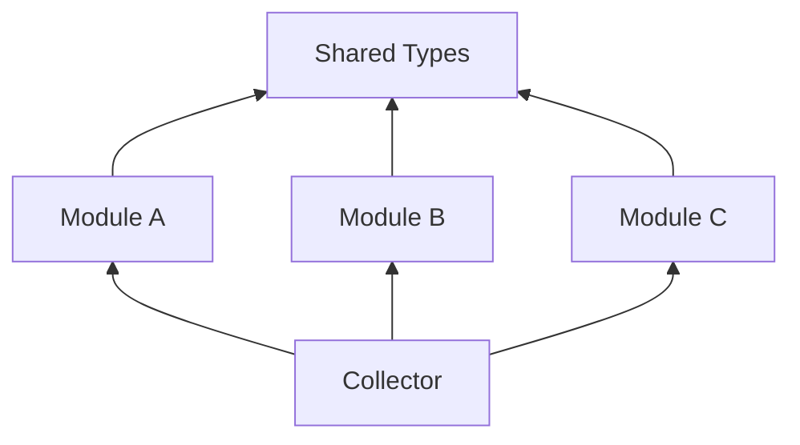
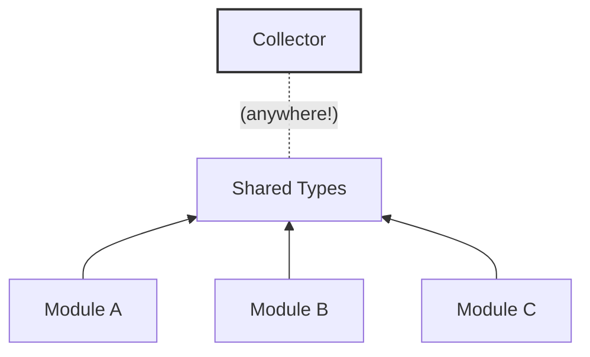

# Life Before Main

> **披露**
>
> 🧠 本文为[100%人工手写](https://grack.com/assets/2026/06/remarkable_life_after_main.pdf)。Claude用于反馈及协助生成链接符号图，Cursor用于反馈及确保示例可编译。
>
> 本文作者对main函数之前的生命周期这一主题深感兴趣：他是[`ctor`](https://crates.io/crates/ctor)库的作者，也是我们将在下文示例中使用的[`linktime`](https://github.com/mmastrac/linktime)项目的创造者。

<details markdown="1">
<summary>原文</summary>

> **Disclosures**
>
> 🧠 This post is [100% human-written](https://grack.com/assets/2026/06/remarkable_life_after_main.pdf). Claude was used for feedback and to assist with the linker symbol diagram. Cursor was used for feedback and to ensure examples were compilable.
>
> The author of this post is deeply interested in the topic of life-before-main: he is the author of the [`ctor`](https://crates.io/crates/ctor) crate, and the creator of the [`linktime`](https://github.com/mmastrac/linktime) project that we'll be using in the examples below.

</details>

每个 Rust 二进制文件都有一个共同点:`fn main()`。如果你来自 C 语言环境，可能更熟悉 `int main(argc, argv)` 这种形式。某些平台可能会将其进一步混淆，但在底层，每个二进制文件都有一个入口点。

<details markdown="1">
<summary>原文</summary>

Every Rust binary has one thing in common: `fn main()`. If you come from the C world, that might be more familiar as `int main(argc, argv)`. Some platforms might obfuscate it a bit more, but under the hood, every binary has an entrypoint.

</details>

我们将讨论在 `main` *之前*发生的事情，以及我们在那里可以做的有趣事情。此外，我们还将展示一些用于可变数据的*新颖技术*，这些技术在当今的 Rust 生态系统中尚未被广泛使用。

<details markdown="1">
<summary>原文</summary>

We're going to discuss what happens *before* `main` and what interesting things we can do there. In addition, we'll be showing some *novel techniques* for mutable data that aren't in common use in the Rust ecosystem today.

</details>

本文深入探讨了 Rust 源代码如何变成 Rust 二进制文件的一些技术细节。读者具备一些背景知识可能会有所帮助，包括:

<details markdown="1">
<summary>原文</summary>

This post is a deep dive into some technical details of how Rust source becomes a Rust binary. Some background knowledge may be helpful to the reader, including:

</details>

- [References in Rust](https://doc.rust-lang.org/book/ch04-02-references-and-borrowing.html)
- [Unsafe Rust](https://doc.rust-lang.org/book/ch20-01-unsafe-rust.html)

## 在 main 之前（Before main）

大多数开发者可能并不熟悉*如何*进入 main 函数。要知道，每种语言的底层都有**运行时**。C 语言有一个：你可能[认为是 `libc`](https://en.wikipedia.org/wiki/C_standard_library)的 C 运行时。Rust 也有自己的运行时：Rust 标准库。由于 C 是大多数可执行代码运行时的通用语言[^1]，Rust 在 C 的基础上构建了自己的运行时，有效地构建了封装 C 的更高级抽象。

<details markdown="1">
<summary>原文</summary>

What might not be familiar to most developers is *how* you get into the main function. You see, under the hood for every language is the **runtime**. C has one: the C runtime that you might [recognize as `libc`](https://en.wikipedia.org/wiki/C_standard_library). Rust also has its own runtime: the Rust standard library. And because C is the lingua franca of runtimes for most executable code[^1], Rust builds its own runtime atop of C's, effectively building its own higher-level abstraction encapsulating C's.

</details>

运行时的定义有点模糊。它既是磁盘上的可执行代码，也是编译时使用的可编译头文件和库。但运行时的目的始终相同：将开发者代码与平台的操作系统集成。

<details markdown="1">
<summary>原文</summary>

A runtime is a bit fuzzy to define. It's both the executable code that lives on disk and compilable headers and libraries used at compile time. But the purpose of a runtime is always the same: integrating developer code with the platform's operating system.

</details>

在你定义的 `main` 函数启动之前，还有一整个处理那些东西的生态系统。C 使用它来配置分配、文件访问、线程本地存储和其他 C 运行时服务。Rust 利用这段时间来配置其语言和运行时的各个部分。具体来说，Rust 有处理 panic 和展开的基础设施。Rust 还需要将 C 风格的程序参数[^2]转换为其自己的 [`std::env::args`](https://doc.rust-lang.org/beta/std/env/fn.args.html) 接口。所有这些机制都[可以在 Rust 编译器项目中看到](https://github.com/rust-lang/rust/blob/main/compiler/rustc_codegen_ssa/src/base.rs#L501)。

<details markdown="1">
<summary>原文</summary>

There's an entire ecosystem of processing that happens before the function you declared as `main` starts up. C uses this to configure allocation, file access, thread-local storage and other C runtime services. Rust uses this time to configure parts of its own language and runtime. Specifically, Rust has infrastructure to handle panics and unwinding. Rust also needs to translate the C-style program arguments[^2] into its own [`std::env::args`](https://doc.rust-lang.org/beta/std/env/fn.args.html) interface. The machinery for all this is [visible in the Rust compiler project](https://github.com/rust-lang/rust/blob/main/compiler/rustc_codegen_ssa/src/base.rs#L501).

</details>

运行时利用这个 main 前阶段，因为它保证了：(1)在用户代码之前运行；(2)单线程、高度一致且可预测顺序的环境；从而实现可靠和确定性的初始化。

<details markdown="1">
<summary>原文</summary>

Runtimes make use of this pre-main phase because it guarantees (1) running before user code, and (2) a single-threaded, highly-consistent and predictably-ordered environment, which allow for reliable and deterministic initialization.

</details>

如果不利用这个环境，你就错过了一个非常有用的引导阶段。我们将在本文后面看到如何利用 main 之前的生命周期来构建一些有用的原语。

<details markdown="1">
<summary>原文</summary>

By not taking advantage of this environment, you are missing out on a very useful bootstrapping phase. We'll see later on in this post how we can build some useful primitives making use of life before main.

</details>

## 入口点（Entry Points）

当操作系统的加载器[^3]——操作系统中将二进制文件加载到内存并设置环境的部分——交出控制权时，二进制文件开始运行。运行时负责接受来自加载器的交接。每个操作系统都有一个平台特定的钩子来接受交接——在某种程度上，这才是*真正的* main。在 Linux 上，入口点[存储在 ELF 头的 `e_entry` 字段中](https://en.wikipedia.org/wiki/Executable_and_Linkable_Format#:~:text=e_entry)，默认情况下，链接器将一个名为 `_start` 的符号的地址放在那里。Windows 上也有[类似的钩子](https://learn.microsoft.com/en-us/windows/win32/debug/pe-format#:~:text=AddressOfEntryPoint)，它在[一个名为 `_WinMainCRTStartup` 的函数中](https://stackoverflow.com/questions/1583193/what-functions-does-winmaincrtstartup-perform)启动可执行文件。此时，C 运行时有机会配置自己，而所有运行时都通过初始化函数来实现这一点。

<details markdown="1">
<summary>原文</summary>

A binary starts when the operating system's loader[^3] - the part of the OS that loads the binary into memory and sets up the environment - hands off control. The runtime is responsible for accepting the hand-off from the loader. There's a platform-specific hook on every OS that accepts the hand-off - to some extent this is the *real* main. On Linux, the entry point [is stored in the `e_entry` field](https://en.wikipedia.org/wiki/Executable_and_Linkable_Format#:~:text=e_entry) of the ELF header, and by default, the linker places the address of a symbol named `_start` there. A similar hook [exists on Windows](https://learn.microsoft.com/en-us/windows/win32/debug/pe-format#:~:text=AddressOfEntryPoint), and boots the executable in [a function named `_WinMainCRTStartup`](https://stackoverflow.com/questions/1583193/what-functions-does-winmaincrtstartup-perform). At this point the C runtime has a chance to configure itself, and the way that all runtimes do this is via initialization functions.

</details>

在早期的运行时迭代中，引导是一个静态的函数调用树:初始化文件 I/O、初始化分配器等。随着运行时变得越来越复杂，这个函数调用树也变得越来越复杂，二进制文件大小也随之增加，以吸收更多它们可能需要或不需要的 C 运行时功能。

<details markdown="1">
<summary>原文</summary>

In early iterations of runtimes, bootstrapping was a static tree of function calls: initialize file I/O, initialize the allocator, etc. As runtimes became more complex, this tree of function calls became more complex, and binary sizes increased to absorb more C runtime functionality that they may or may not need.

</details>

随着时间的推移，链接器开发了在将二进制文件写入磁盘之前丢弃未使用代码的能力(包括 C 运行时中未使用的部分)，由此出现了需要替换静态初始化调用树的方法。

<details markdown="1">
<summary>原文</summary>

Over time, linkers developed the ability to discard unused code before even writing the binary to disk (including unused parts of the C runtime), and with that came a need for a replacement for the static init call trees.

</details>

声明初始化代码的最流行方法[^4]来自 GCC:`__attribute__((constructor))`。其工作原理是将初始化函数列表放入磁盘上二进制文件的连续块中。当 C 运行时启动时，它可以遍历这些函数并调用它们，允许 C 运行时的各个部分请求初始化，而无需强耦合子系统，并允许链接器丢弃未使用的子系统，包括初始化代码。

<details markdown="1">
<summary>原文</summary>

The most popular method[^4] of declaring init code came from GCC: `__attribute__((constructor))`. The way this worked was to place a list of init functions into a contiguous chunk of the binary on disk. When the C runtime started, it could walk through each of these functions and call them, allowing various bits of the C runtime to request initialization without strongly coupling subsystems, and allowing the linker to jettison unused subsystems, init code and all.

</details>

最终，构造函数排序的需求变得足够重要，以至于可以为构造函数赋予优先级并按特定顺序运行，允许运行时按彼此先后顺序初始化子系统。例如，内存分配(`malloc`)子系统可能是缓冲文件 I/O 所必需的。

<details markdown="1">
<summary>原文</summary>

Eventually the need for constructor ordering became important enough that constructors could be given a priority and run in a specific order, allowing the runtime to initialize subsystems before and after each other. E.g., the memory allocation (`malloc`) subsystem might be needed for buffered file I/O.

</details>

在大多数平台上[^5]，链接器被调用来完成优先级工作：每个平台最终都有了一种方法来优先处理数据写入段的顺序，这使得 C 运行时最终得到一个良好排序的函数指针列表[^6]。

<details markdown="1">
<summary>原文</summary>

On most platforms[^5], the linker was called in to do the priority work: each platform ended up with a way to prioritize the order in which data gets written to sections, which allowed for the C runtime to end up with a well-ordered list of function pointers[^6].

</details>

我们甚至可以使用 `#[unsafe(link_section = "...")]` 属性在 Rust 中手动构建这样一个示例([在 Rust Playground 中尝试](https://play.rust-lang.org/?version=stable&mode=debug&edition=2024&gist=61a54d3cde75e732db52558f4ef9381c)):

<details markdown="1">
<summary>原文</summary>

We can even build an example of this by hand in Rust using the `#[unsafe(link_section = "...")]` attribute ([try it in the Rust Playground](https://play.rust-lang.org/?version=stable&mode=debug&edition=2024&gist=61a54d3cde75e732db52558f4ef9381c)):

</details>

```rust
/// Linux 示例：现代 glibc 运行时使用 `.init_array` 来保存函数指针，
/// 数字后缀允许它们被排序。注意，优先级 小于或等于 100 的保留给运行时本身，
/// 所以任何想要使用 C 运行时的代码必须使用 101 或更大数字的优先级。

// 在 Linux 上，`.init_array` 保存的是*函数指针*，而不是函数。
// 我们可以通过以下块之一将函数转换为函数指针，这等价于：
//
// #[used] // <-- 没有这个，Rust 可能会认为初始化函数未使用并将其移除
// #[unsafe(link_section = ".init_array.NNNNN")] // <-- 我们放置函数指针的段
// static INIT_ARRAY_FN_PTR: extern "C" fn() 
//     = function; // <-- 函数指针数据：我们将函数赋值给它
//
// extern "C" fn function() { ... } // <-- 函数本身

#[used]
#[unsafe(link_section = ".init_array.101")]
static INIT_FN_FIRST: extern "C" fn() = const {
    extern "C" fn init() {
        println!("Initializing (first!)");
    }
    init
};

#[used]
#[unsafe(link_section = ".init_array.201")]
static INIT_FN_SECOND: extern "C" fn() = const {
    extern "C" fn init() {
        println!("Initializing (second!)");
    }
    init
};

fn main() {
    println!("Main!")
}
```

## 链接时：ctor、link-section 等（linktime: ctor, link-section and more）

> 本文中的示例将在 Linux 和各种 BSD 上运行，但并非设计为跨平台示例。例如，macOS 有 `start` 和 `stop` 符号，但它们的命名方式不同[^7]。Windows 不支持 `start` 和 `stop` 符号，但有一套实际上等效的段排序规则。
> 
> 由于平台差异很大，我们将介绍 [`ctor`](https://crates.io/crates/ctor) 和 [`link-section`](https://crates.io/crates/link-section) crate（来自 [`linktime`](https://github.com/mmastrac/linktime) 项目），作为一种抽象掉平台特定差异并隐藏链接器工作一般复杂性的方法。
> 
> 优秀的 [`inventory`](https://crates.io/crates/inventory) 和 [`linkme`](https://crates.io/crates/linkme) 是另外两个基于相同原理构建的非常流行的 crate，但它们有一些限制[^8]，使它们不太适合本文中的示例。
> 
> 如果你想了解更多，`link-section` crate 包含一份[关于平台特定行为的详细报告](https://crates.io/crates/link-section#:~:text=Platform%20Support)。

<details markdown="1">
<summary>原文</summary>

> The examples in this post will work on Linux and various BSDs, but are not designed to be cross-platform examples. For example, macOS has `start` and `stop` symbols, but they are named differently[^7]. Windows does not support `start` and `stop` symbols, but has a set of rules for sorting sections that is effectively equivalent.
>
> Because platforms are so widely variable, we'll be introducing the [`ctor`](https://crates.io/crates/ctor) and [`link-section`](https://crates.io/crates/link-section) crates (from the [`linktime`](https://github.com/mmastrac/linktime) project) as a way to abstract away platform-specific differences and hide the general complexity of linker work.
>
> The excellent [`inventory`](https://crates.io/crates/inventory) and [`linkme`](https://crates.io/crates/linkme) are two other very popular crates built on the same principles, but have limitations[^8] that make them less suitable for the examples in this post.
>
> If you'd like to learn more, the `link-section` crate contains a [detailed report on platform-specific behaviour](https://crates.io/crates/link-section#:~:text=Platform%20Support).

</details>

[`ctor`](https://crates.io/crates/ctor) crate 旨在以跨平台的方式处理注册构造函数的所有样板代码。这允许我们将上面的示例简化为：

<details markdown="1">
<summary>原文</summary>

The [`ctor`](https://crates.io/crates/ctor) crate is designed to handle all of the boilerplate of registering constructors in a cross-platform way. This allows us to simplify our examples above to:

</details>

```rust
use ctor::ctor;

#[ctor(unsafe, priority = 101)]
fn init1() {
    println!("Initializing (first)!");
}

#[ctor(unsafe, priority = 201)]
fn init2() {
    println!("Initializing (second)!");
}

fn main() {
    println!("Main!")
}
```

请注意，这两个示例都没有显式调用初始化函数。链接器以一种让 C 运行时为我们调用它们的方式组织了它们！

<details markdown="1">
<summary>原文</summary>

Note that neither example explicitly calls the init functions. The linker organized them in a way that the C runtime called them for us!

</details>

## 段和链接器脚本（Sections and Linker Scripts）

构造函数链接的过程并不神秘。事实上，编译器允许你命名二进制文件中（在大多数平台上称为“段”）你想要放置任何数据和/或代码的位置。由此延伸，正如我们上面看到的，Rust 也允许这样做。挑战在于，正如我们将看到的，如何利用这种组织特性。

<details markdown="1">
<summary>原文</summary>

The process in which constructors are linked isn't mysterious, though. In fact, compilers allow you to name the location in the binary (on most platforms called a "section") you want to place any of your data and/or code. And by extension, and as we saw above, Rust allows this as well. The challenge, as we will see, is making use of this organizational feature.

</details>

链接器一直是 C 能够面向任何形式二进制文件的关键。大多数链接器允许开发者提供**链接器脚本**——与你的源代码（编译为目标文件）一起存在的文本文件，并指示链接器如何组装这些目标文件。使用链接器脚本，单个 C 文件可以成为 Linux 可执行文件，或者位于硬盘引导扇区中的原始汇编代码块。

<details markdown="1">
<summary>原文</summary>

Linkers have been the key to C's ability to target any form of binary for some time. Most linkers allow for developers to provide **linker scripts** - text files that live alongside your source code (which is compiled to object files) and instruct the linker on how those object files are assembled. Using a linker script, a single C file might become a Linux executable, or a block of raw assembly that lives in the boot sector of a hard drive.

</details>

链接器脚本还允许定义虚拟符号——即不存在于任何源文件中但可以被 C 代码用来访问已加载二进制文件中底层数据指针的符号。

<details markdown="1">
<summary>原文</summary>

Linker scripts also allow for defining virtual symbols - that is, symbols that don't exist in any source file but can be used by C code to access pointers to the underlying data in the loaded binary.

</details>

链接器脚本是一个复杂的话题，超出了本文的范围，但我们可以[轻松找到](https://wiki.osdev.org/Linker_Scripts)它们的实际示例：

<details markdown="1">
<summary>原文</summary>

Linker scripts are a complex topic and beyond the scope of this post, but we can [easily find examples](https://wiki.osdev.org/Linker_Scripts) of them in the wild:

</details>

```
// Adapted from https://wiki.osdev.org/Linker_Scripts
SECTIONS
{
  .text.start (_KERNEL_BASE_) : {
    startup.o( .text )
  }

  .text : ALIGN(CONSTANT(MAXPAGESIZE)) {
_TEXT_START_ = .;
    *(.text)
_TEXT_END_ = .;
  }

  .data : ALIGN(CONSTANT(MAXPAGESIZE)) {
_DATA_START_ = .;
    *(.data)
_DATA_END_ = .;
  }
}
```

在上面的示例中，虚拟符号 `_TEXT_START_` 和 `_TEXT_END_` 被显式定义为分别指向 `.text` 段的开头和结尾。`_TEXT_START_ = .;` 中的句点是一种特殊语法，指的是[一个*位置计数器*](https://sourceware.org/binutils/docs/ld/Location-Counter.html)，它大致解析为二进制文件中的当前输出地址。

<details markdown="1">
<summary>原文</summary>

In the above example, the virtual symbols `_TEXT_START_` and `_TEXT_END_` are explicitly defined to point to the beginning and end of the `.text` section, respectively. The period in `_TEXT_START_ = .;` is a special syntax that refers to [a *location counter*](https://sourceware.org/binutils/docs/ld/Location-Counter.html) that resolves roughly to the current output address in the binary.

</details>

## 链接器符号（Linker Symbols）

这会让大多数首次遇到的开发者感到困惑，但链接器是*设置起始和结束符号的地址*，因此设置了同名 `static` 的位置，而*不是*设置作为指针的符号的值。也就是说：起始和停止符号不是 `*const Type`。起始和停止符号本身不携带任何数据，仅用于它们的地址！段由起始（包含）和停止（不包含）符号*之间*的数据范围组成。

<details markdown="1">
<summary>原文</summary>

This trips up most developers that encounter it for the first time, but the linker is *setting the address of the start and end symbols*, and therefore where the `static` with the same name is placed, and *not* setting the value of symbols that are pointers. That is to say: the start and stop symbols aren't a `*const Type`. The start and stop symbols carry no data themselves and are used for their addresses only! The section consists of the range of data *between* the start (inclusive) and stop (exclusive) symbols.

</details>

<table id="link_symbol_diagram">
  <thead>
    <tr>
      <th>Section</th>
      <th>Static</th>
      <th>Value</th>
      <th></th>
      <th>Linker symbol(s)</th>
    </tr>
  </thead>
  <tbody>
    <tr>
      <td rowspan="4" class="slashed-background"><code>my_numbers</code></td>
      <td><code>_DATA_1</code></td>
      <td><code>11</code></td>
      <td rowspan="4">⎫<br>⎬<br>⎭</td>
      <td><code>_DATA_1, _start_my_numbers</code></td>
    </tr>
    <tr>
      <td><code>_DATA_2</code></td>
      <td><code>22</code></td>
      <td><code>_DATA_2</code></td>
    </tr>
    <tr>
      <td><code>_DATA_3</code></td>
      <td><code>33</code></td>
      <td><code>_DATA_3</code></td>
    </tr>
    <tr>
      <td><code>_DATA_4</code></td>
      <td><code>44</code></td>
      <td><code>_DATA_4</code></td>
    </tr>
    <tr>
      <td></td>
      <td colspan="2"><code>(past the end)</code></td>
      <td>↤</td>
      <td><code>_stop_my_numbers</code></td>
    </tr>
  </tbody>
</table>

在链接器脚本中为每个段指定起始和结束符号可能很复杂且繁琐，因此许多链接器[^9]最终获得了一个功能，可以自动定义包围可执行文件中所有段的符号。例如，对于 GNU 工具链，名为 `MY_SECTION` 的段将自动定义符号 `__start_MY_SECTION` 和 `__stop_MY_SECTION`。macOS 有[类似的模式](https://discourse.llvm.org/t/lld-support-for-ld64-mach-o-linker-synthesised-symbols/45145)，它为每个段合成一个 `section$start` 和 `section$end` 符号。

<details markdown="1">
<summary>原文</summary>

Specifying start and end symbols for every section can be complex and tedious in linker scripts, so many linkers[^9] eventually gained a feature where they could automatically define symbols bounding all sections in the executable. E.g., for GNU toolchains, a section named `MY_SECTION` will automatically have symbols `__start_MY_SECTION` and `__stop_MY_SECTION` defined. macOS has [a similar pattern](https://discourse.llvm.org/t/lld-support-for-ld64-mach-o-linker-synthesised-symbols/45145) where it synthesizes a `section$start` and `section$end` symbol for each section.

</details>

在 GNU 链接器中，那些未在链接器脚本中显式定义的段被称为“孤立段”[^10]。需要注意的一件重要事情：当（且仅当！）段的名称与 C 符号名称兼容，链接器将自动为该段定义以 `_start` 和 `_stop` 为前缀的符号。在下面你将看到的示例中，我们使用的段名称 `our_strings` 是有效的，但如果我们选择 `our.strings` 或 `.our_strings` 则不会有效！

<details markdown="1">
<summary>原文</summary>

In the GNU linker, those sections not explicitly defined in the linker script are called "orphan sections"[^10]. One important thing to note: if (and only if!) a section's name is compatible with a C symbol name, the linker will automatically define a `_start`- and `_stop`-prefixed symbol for the section. In the example you'll see below, the section name `our_strings` that we used works, but if we had chosen `our.strings` or `.our_strings` it would not have!

</details>

> 你将在下面的示例中看到起始和停止符号是 `MaybeUninit<()>`。边界符号不包含数据，只有它们的地址是有意义的。
> 
> 这些的理想 Rust 类型应该是“不透明外部类型”（这将由 [`extern_types` 特性](https://doc.rust-lang.org/beta/unstable-book/language-features/extern-types.html)实现）。由于这些目前在稳定版 Rust 中尚未实现，`MaybeUninit` 是一个替代品。它向编译器表明数据未初始化，而且通过引用读取通常是不安全的。然而，由于获取 `static` 项的 [`&raw const` 指针](https://blog.rust-lang.org/2024/10/17/Rust-1.82.0/#native-syntax-for-creating-a-raw-pointer)始终有效，我们仍然可以安全地捕获其地址而无需读取其值。

<details markdown="1">
<summary>原文</summary>

> You'll see in the example below that the start and stop symbols are `MaybeUninit<()>`. The boundary symbols contain no data, and only their address is significant.
>
> The ideal Rust type for these would be an "opaque external type" (this would be implemented by the [`extern_types` feature](https://doc.rust-lang.org/beta/unstable-book/language-features/extern-types.html)). As these are not currently implemented in Stable Rust, `MaybeUninit` is a stand-in. It signifies to the compiler that the data is uninitialized, and generally not safe to read via reference. Since taking a [`&raw const` pointer](https://blog.rust-lang.org/2024/10/17/Rust-1.82.0/#native-syntax-for-creating-a-raw-pointer) to a `static` item is always valid, however, we can still safely capture its address without ever reading its value.

</details>

[在 Rust Playground 中尝试](https://play.rust-lang.org/?version=stable&mode=debug&edition=2024&gist=1696bdc67f02992cfde9de752e117e0e)：

```rust
use std::mem::MaybeUninit;

#[used]
#[unsafe(link_section = "our_strings")]
static FIRST_STRING: &'static str = "Hello, ";

#[used]
#[unsafe(link_section = "our_strings")]
static SECOND_STRING: &'static str = "world!";

// 注意：这些不是指针。作为替代，链接器已将边界符号
// STATIC_STRING_START 和 STATIC_STRING_END
// 放置在段的开头和结尾！
unsafe extern "C" {
    #[link_name = "__start_our_strings"]
    static STATIC_STRING_START: MaybeUninit<()>;
    #[link_name = "__stop_our_strings"]
    static STATIC_STRING_END: MaybeUninit<()>;
}

fn main() {
    let strings: &'static [&'static str] = unsafe {
        // SAFETY: 获取起始和结束符号的地址而不读取它们。
        let start = &raw const STATIC_STRING_START as *const &'static str;
        let end = &raw const STATIC_STRING_END as *const &'static str;
        std::slice::from_raw_parts(start, end.offset_from(start) as usize)
    };

    // "Hello, world!"
    println!("String: {}", strings.join(""));
}
```

[`link-section`](https://crates.io/crates/link-section) crate 旨在抽象掉这些链接器段的细节，并将它们转换为具有所有标准切片操作的传统 Rust 切片。我们可以使用它将上面的示例简化为：

<details markdown="1">
<summary>原文</summary>

The [`link-section`](https://crates.io/crates/link-section) crate is designed to abstract away the details of these linker sections and convert them into traditional Rust slices with all standard slice operations available. We can use it to simplify the example above to:

</details>

```rust
use link_section::{in_section, section};

#[section(typed)]
static OUR_STRINGS: link_section::TypedSection<&'static str>;

#[in_section(OUR_STRINGS)]
static FIRST_STRING: &'static str = "Hello, ";

#[in_section(OUR_STRINGS)]
static SECOND_STRING: &'static str = "world!";

fn main() {
    println!("String: {}", OUR_STRINGS.join(""));
}
```

在这些示例中，我们在单个 crate 的单个模块中将项提交到链接段，但这不是必需的。事实上，链接段的强大之处在于，你可以从*任何一个*为二进制文件贡献代码的 crate 中将项提交到链接段——链接器将在写入最终二进制文件之前将它们全部收集在一起。

<details markdown="1">
<summary>原文</summary>

In these examples we're submitting items to the link section in a single module within a single crate, but that's not a requirement. In fact, the power of link sections is that you can submit items to a link section from *any* crate that contributes code to a binary - the linker will gather them all together just before writing the final binary.

</details>

## 依赖注入（Dependency Injection）

我们即将构建的注册模式是[依赖注入](https://en.wikipedia.org/wiki/Dependency_injection)的另一种形式。这是一个众所周知的模式：像 [Dagger](https://dagger.dev/) 和 [Spring](https://spring.io/) 这样的框架都建立在同样的原则上，即注册数据的*消费者*不应与数据的*提供者*耦合。*提供者*在其声明位置注册数据，*消费者*只需读取注册表。

<details markdown="1">
<summary>原文</summary>

The registration pattern we're about to build is [Dependency Injection](https://en.wikipedia.org/wiki/Dependency_injection) by another name. This is a well-known pattern: frameworks like [Dagger](https://dagger.dev/) and [Spring](https://spring.io/) are built on the same principle that *consumers* of registration data should not be coupled to the *providers* of that data. A *provider* registers data at its definition site, a *consumer* simply reads the registry.

</details>

链接器段与传统 DI 的不同之处在于，在 DI 中，框架通常需要在启动时遍历模块图或扫描加载的类以发现提供者和消费者位置。使用链接器段，这种魔法在写入二进制文件时处理。链接器负责收集所有提供者数据并使其对消费者来说易于访问。

<details markdown="1">
<summary>原文</summary>

What's somewhat different with linker sections versus traditional DI is that in DI the framework often needs to walk the module graph or scan loaded classes at startup to discover both providers and consumer sites. With linker sections, this magic is handled when the binary is written. The linker is the one that gathers all of the provider data and makes it trivially available to the consumer.

</details>

下面的示例使用 `link_section::section` 来注册 CLI 子命令，这是该模式的一个实例。像 [Turbopack](https://github.com/vercel/next.js/blob/canary/turbopack/) 这样更复杂的项目使用此模式来注册字符串池常量，以及用于序列化/反序列化和 [turbotask 增量编译函数](https://web.archive.org/web/20250222021941/https://turbo.build/pack/docs/incremental-computation)的注册机制。一个假设的 web 服务器可以利用此模式来注册在构建时自动收集的路由和中间件。核心机制相同：贡献者将数据放入来自依赖树中任何 crate 的共享注册系统，消费者读取收集的数据而无需知道它来自哪里。

<details markdown="1">
<summary>原文</summary>

The example below uses a `link_section::section` to register CLI subcommands and is an instance of this pattern. More complex projects like [Turbopack](https://github.com/vercel/next.js/blob/canary/turbopack/) use this pattern to register string-pool constants, and the registration machinery used for serialization/deserialization and [turbotask incremental compilation functions](https://web.archive.org/web/20250222021941/https://turbo.build/pack/docs/incremental-computation). A hypothetical webserver could make use of this pattern to register routes and middleware that are automatically collected at build time. The core mechanism is the same: the contributors place data into a shared registration system from any crate in the dependency tree, and the consumer reads the collected data without having to know where it was provided from.

</details>

## 使用段进行注册（Using Sections for Registration）

我们在 main 之前工作的一个优势是它是行为良好的。除非我们启动线程，否则没有线程在运行。这意味着在许多情况下我们可以避免锁和其他同步原语的复杂性，并且我们可以明确地将数据的可写和不可变阶段清晰地分开：main 之前和之后。因此，通过避免需要获取和释放锁，访问运行程序中的数据可以变得更简单和更高效。

<details markdown="1">
<summary>原文</summary>

One advantage we have in doing work before main is that it is well-behaved. No threads are running unless we start them. This means we are able to avoid the complexity of locks and other synchronization primitives in many cases, and that we can explicitly split our writable and immutable phase of our data's lifecycle clearly: before and after main. And because of that, accessing data in the running program can become both simpler and more efficient by avoiding the need to acquire and release locks.

</details>

首先，我们要定义我们的子命令、一个 `const` 构造函数以及一个 `#[section]` 来收集它们：

<details markdown="1">
<summary>原文</summary>

First, we'll define our subcommand, a `const` constructor function, and a `#[section]` to collect them:

</details>

```rust
use std::collections::VecDeque;
use std::path::Path;

use link_section::{in_section, section};

struct CliSubcommand {
    is_default: bool,
    name: &'static str,
    description: &'static str,
    f: fn(&Path, &[String]),
}

impl CliSubcommand {
    const fn new(name: &'static str,
                 description: &'static str,
                 f: fn(&Path, &[String])) -> Self {
        Self { is_default: false, name, description, f }
    }

    const fn new_default(name: &'static str,
                        description: &'static str,
                        f: fn(&Path, &[String])) -> Self {
        Self { is_default: true, name, description, f }
    }
}

#[section(typed)]
static CLI_SUBCOMMANDS: link_section::TypedSection<CliSubcommand>;
```

然后我们要注册子命令——这些可以存在于你的代码中的*任何地方*：

<details markdown="1">
<summary>原文</summary>

Then we'll register subcommands - these can live *anywhere* in your code:

</details>

```rust
mod list {
    #[in_section(CLI_SUBCOMMANDS)]
    static CLI_SUBCOMMAND_LIST: CliSubcommand =
        CliSubcommand::new("list", "List all items", |_exe, _args| {
            println!("Listing all items");
        });
}

mod add {
    #[in_section(CLI_SUBCOMMANDS)]
    static CLI_SUBCOMMAND_ADD: CliSubcommand =
        CliSubcommand::new("add", "Add a new item", |_exe, _args| {
            println!("Adding a new item");
        });
}

mod help {
    #[in_section(CLI_SUBCOMMANDS)]
    static CLI_SUBCOMMAND_HELP: CliSubcommand =
        CliSubcommand::new_default("help", "Show help", |exe, _args| {
            println!("Usage: {} <subcommand> [options]", exe.display());
            println!();
            println!("Subcommands:");
            for subcommand in CLI_SUBCOMMANDS {
                println!("  {}: {}", subcommand.name, subcommand.description);
            }
        });
}
```

然后在我们的 `main` 函数中，我们可以动态分派到任何注册的子命令，而无需知道它们是什么或它们在哪里。它只需要能够看到 `CLI_SUBCOMMANDS` 段定义：

<details markdown="1">
<summary>原文</summary>

And then in our `main` function we can dynamically dispatch to any registered subcommand without ever having to know what they are or where they live. It only needs to be able to see the `CLI_SUBCOMMANDS` section definition:

</details>

```rust
fn main() {
    let mut args: VecDeque<String> = std::env::args().collect();
    let exe = args.pop_front().expect("No executable name provided");
    let exe = Path::new(&exe);
    let subcommand_name = args.pop_front().unwrap_or_default();
    let rest: Vec<String> = args.into();

    // 尝试按名称查找子命令
    for cmd in CLI_SUBCOMMANDS {
        if cmd.name == subcommand_name {
            (cmd.f)(exe, &rest);
            return;
        }
    }
    // 如果未找到子命令，回退到默认子命令
    for cmd in CLI_SUBCOMMANDS {
        if cmd.is_default {
            (cmd.f)(exe, &rest);
            return;
        }
    }
}
```

运行上面的代码会如你所料地工作：

<details markdown="1">
<summary>原文</summary>

Running the code above works as you'd expect:

</details>

```bash
$ ./cli
Usage: ./cli <subcommand> [options]

Subcommands:
  list: List all items
  add: Add a new item
  help: Show help

$ ./cli list
Listing all items
```

## 超越不可变数据（Beyond Immutable Data）

> 本节涉及一些更高级的主题。建议熟悉 [Rust Atomics and Locks](https://marabos.nl/atomics/)，或者至少阅读第一章关于 Rust 并发性基础的内容！

<details markdown="1">
<summary>原文</summary>

> This section deals with some more advanced topics. Familiarity with [Rust Atomics and Locks](https://marabos.nl/atomics/), or at least reading the first chapter on the basics of Rust concurrency, is recommended!

</details>

上面的示例假设链接的数据是不可变的。但这只是使用链接器组织数据的一半能力。全局静态数据中的可变性是标准 Rust 中一个[有已知解决方案的常见问题](https://doc.rust-lang.org/reference/interior-mutability.html)。我们可以潜在地使用 Rust 内置的内部可变性工具，如互斥锁或原子类型。它们每个都带有*一定的*运行时成本。如果它们“无竞争”，那么它们并不昂贵，但也不一定是免费的。[^11]

<details markdown="1">
<summary>原文</summary>

The example above assumes that the linked data is immutable. But that's only half the power of using linker organization for data. Mutability in global static data is a [common problem with well-known solutions](https://doc.rust-lang.org/reference/interior-mutability.html) in standard Rust. We could potentially use Rust's built-in tools for interior mutability like mutexes, or atomic types, for example. Each of those comes with *some* runtime cost. If they are "uncontended" they aren't expensive, but they are not necessarily free.[^11]

</details>

但是，如果我们想最小化运行时数据访问的开销呢？不可变数据很简单：Rust 默认允许安全地并发访问不可变数据[^12]。然而，Rust 对可变数据有严格的要求。安全地改变数据有两个要求：(1) 修改必须以线程安全的方式完成；(2) 如果存在可变引用，则绝不能有多个对数据的引用。

<details markdown="1">
<summary>原文</summary>

But what if we want to minimize the overhead of runtime data access? Immutable data is trivial: Rust allows safe concurrent access to immutable data by default[^12]. Rust has strict requirements for mutable data, however. There are two requirements to safely mutate data: (1) the modifications must be done in a thread-safe manner, and (2), there must never be more than one reference to the data if a mutable reference exists.

</details>

在本文开头，我们提到 main 之前的生命周期是一个进行引导的有用位置，因为除非我们启动线程，否则没有线程在运行。如果数据当前仅对单个线程可访问，那么 (1) 的解决方案就很简单！我们不需要以原子方式做任何事情；我们只需要确保我们对数据所做的所有更改都[“先于”（happens before）](https://marabos.nl/atomics/)任何读取。在单线程环境中，“发生先于”是自动的[^13]。这意味着我们可以在 main 前在链接段中修改数据，并且在 main 之后从任何线程访问它都是安全的，无需锁。

<details markdown="1">
<summary>原文</summary>

At the beginning of this post, we mentioned that life-before-main is a useful place to bootstrap because no threads are running unless we start them. And the solution to (1) is trivial if the data is currently accessible to a single thread only! We don't need to do anything atomically; we only need to ensure that all of the changes we make to that data ["happen before"](https://marabos.nl/atomics/) any reads to the data. In a single-threaded environment, "happens before" is automatic[^13]. This means that we can mutate data in a link-section before main and it will be safe to access, lock free, from any thread after main.

</details>

(2) 的解决方案类似：只要我们在 *main 之前*只获取可变引用（且只有一个可变引用！），当存在可变引用时，就绝不会有超出一个对数据的引用。

<details markdown="1">
<summary>原文</summary>

The resolution for (2) is similar: as long as we only ever take a mutable reference (and only a mutable reference!) *before main*, there will never be more than one reference to the data when a mutable reference exists.

</details>

main 前环境满足*两者* (1) 和 (2)，而无需使用锁或其他同步原语。

<details markdown="1">
<summary>原文</summary>

The pre-main environment satisfies *both* (1) and (2), without needing to reach for locks or other synchronization primitives.

</details>

链接器段还有一个额外的陷阱需要我们非常小心：包含段中所有项的切片也是存在于段中的静态项的*别名*。关于别名的规则同样适用于切片和静态项，你*必须*确保静态项放置在 `UnsafeCell` 中以安全地从切片中改变它们[^14]。Rust 不允许通过其他方式修改静态项。对于未包装在 `UnsafeCell` 中的静态项，LLVM 可能会认为自己可以自由地缓存、重新排序或对数据本身做出其他假设。`UnsafeCell` 本身不是 `Sync`，所以你需要在此基础上添加自己的包装类型！

<details markdown="1">
<summary>原文</summary>

There's also one additional gotcha with linker sections we need to be very careful with: the slice that contains all of the items in a section is an *alias* to the static item that lives in the section. The rules about aliasing apply to both the slice and the static item, and you *must* ensure that static items are placed in `UnsafeCell` to safely mutate them from the slice[^14]. Rust does not allow a static item to be modified through other means. With static items that aren't wrapped in an `UnsafeCell`, LLVM may consider itself free to cache, reorder or otherwise make assumptions about the data itself. `UnsafeCell` itself is not `Sync`, so you'll need to add your own wrapper types on top of this!

</details>

> 注意，在下面的示例中，我们现在对边界符号使用 `MaybeUninit<SyncUnsafeCell<...>>`，对项使用 `SyncUnsafeCell<...>`。
> 
> 因为我们计划对切片进行排序，我们需要告诉 Rust 切片项不是不可变的，这样数据就不会最终位于只读内存中。通过使用包含 `UnsafeCell` 的类型——Rust 用来指示[内部可变性](https://doc.rust-lang.org/reference/interior-mutability.html)的语义信号——Rust 编译器就会知道将该数据放在二进制文件中可写的部分。
> 
> 在某些平台上（特别是 Windows），从数据项中省略此内容会在尝试对切片进行排序时导致段错误。在其他平台上（例如 AIX），段可变性是段标识符的一部分，因此边界符号的可变性需要与段的可变性匹配！

<details markdown="1">
<summary>原文</summary>

> Note that in the example below, we're now using `MaybeUninit<SyncUnsafeCell<...>>` for the boundary symbols and `SyncUnsafeCell<...>` for the items.
>
> Because we're planning on sorting the slice, we need to tell Rust that the slice items are not immutable so the data doesn't end up in read-only memory. By using a type that includes `UnsafeCell` - a semantic signal that Rust uses to indicate [interior mutability](https://doc.rust-lang.org/reference/interior-mutability.html) - the Rust compiler will then know to place that data in a part of the binary that can be written.
>
> On some platforms (Windows in particular), omitting this from the data items will cause segmentation faults when trying to sort the slice. On other platforms (AIX for example), section mutability is part of a section's identifier, so the boundary symbols' mutability needs to match the section's mutability!

</details>

让我们来看一个我们如何以其他方式做类似事情的示例。我们将构建一个完全在链接时定义的字符串驻留池，并增加一个转折：我们希望能够在运行时对驻留字符串的切片进行排序，以便在需要时通过二分搜索快速按值驻留字符串（[在 Rust Playground 中尝试](https://play.rust-lang.org/?version=stable&mode=debug&edition=2024&gist=cc4df8dc5aba46357a5f6c64ce11e587)）：

<details markdown="1">
<summary>原文</summary>

Let's walk through an example of how we might otherwise do something like this. We're going to build a string interning pool defined entirely at link-time, and add a wrinkle: we want to be able to sort the slice of interned strings at runtime so we can quickly intern a string by value if needed via binary search ([try it in the Rust Playground](https://play.rust-lang.org/?version=stable&mode=debug&edition=2024&gist=cc4df8dc5aba46357a5f6c64ce11e587)):

</details>

```rust
use std::cell::UnsafeCell;
use std::mem::MaybeUninit;
#[cfg(debug_assertions)]
use std::sync::atomic::{AtomicBool, Ordering};

/// Nightly Rust 提供了一个内置的 `SyncUnsafeCell`。这是它的最小重新实现：
/// <https://doc.rust-lang.org/std/cell/struct.SyncUnsafeCell.html>
#[repr(transparent)]
struct SyncUnsafeCell<T: ?Sized>(UnsafeCell<T>);
// SAFETY: UnsafeCell 的安全负担完全放在用户身上
unsafe impl<T: ?Sized + Sync> Sync for SyncUnsafeCell<T> {}

macro_rules! intern_string {
    ($name:ident, $string:literal) => {
        #[allow(unused)]
        const $name: &'static str = const {
            // 这不是一个常见的模式，但在 const 块中嵌套 static 项是完全有效的。
            // 你可以将其视为一种将符号隐藏在完全匿名的命名空间中的方法。
            const VALUE: &str = $string;
            // 安全说明：这个 static _绝不能_被使用。
            // 这纯粹是向链接器提交的内容，对它进行_任何_访问都可能是 UB。
            #[used]
            #[unsafe(link_section = "our_strings")]
            static ITEM: SyncUnsafeCell<&'static str> =
                SyncUnsafeCell(UnsafeCell::new(VALUE));
            VALUE
        };
    };
}

intern_string!(WORLD, "world");
intern_string!(EXCLAMATION, "!");
intern_string!(HELLO, "hello");
intern_string!(FROM, "from");
intern_string!(RUST, "Rust");

unsafe extern "C" {
    #[link_name = "__start_our_strings"]
    static STATIC_STRING_START: MaybeUninit<SyncUnsafeCell<()>>;
    #[link_name = "__stop_our_strings"]
    static STATIC_STRING_END: MaybeUninit<SyncUnsafeCell<()>>;
}

/// 调试检查以确保切片被排序一次且只一次。这_可以_在 release 模式下启用
/// 而不会产生任何重大性能影响，但我们有足够的保证。注意，原子访问_确实_
/// 建立了一些内存顺序保证，但无论是否有这个原子检查，健全性保证都会得到维持。
#[cfg(debug_assertions)]
static SLICE_IS_SORTED: AtomicBool = AtomicBool::new(false);

// 实现说明：在 `SORT_STRINGS_CTOR` 运行之前不得调用此函数。
fn interned_strings() -> &'static [&'static str] {
    // 我们使用 Acquire/Release 配对作为双重初始化检查
    #[cfg(debug_assertions)]
    debug_assert!(SLICE_IS_SORTED.load(Ordering::Acquire), "Oh no! Slice was not sorted!");

    // SAFETY: 我们在 main 之后调用它，并且我们可以保证没有可变引用仍然存活。
    // 由于我们知道在 main 之前没有其他代码在运行，并且 `SORT_STRINGS_CTOR`
    // 会在 main 之前运行，我们可以保证创建这些切片是安全的，因为
    // 1) 排序“先于”任何访问
    // 2) 可变引用在任何读引用访问之前已关闭（满足别名亦或可变性要求）。
    let strings: &'static [&'static str] = unsafe {
        let start = &raw const STATIC_STRING_START as *const &'static str;
        let end = &raw const STATIC_STRING_END as *const &'static str;
        std::slice::from_raw_parts(start, end.offset_from(start) as usize)
    };
    strings
}

// 实现说明：此函数假设切片已被排序。有关推理，请参见上面 `interned_strings` 的保证。
fn maybe_intern_string(s: impl AsRef<str>) -> Option<&'static str> {
    let s = s.as_ref();
    let strings = interned_strings();
    strings.binary_search(&s).ok().map(|index| strings[index])
}

// SAFETY: 我们使用保留的 `.init_array.0` 优先级，因为我们不访问任何
// C 运行时函数（sort_unstable 不涉及分配）并且我们希望在所有其他代码之前运行。
// `.init_array.101` 在我们的场景下也可以工作，但这可以防止其他早期初始化代码
// 意外地以错误的顺序运行。`SLICE_IS_SORTED` 是一个调试检查，以确保这种情况
// 不会发生。注意，所有早期初始化代码都标记为 `unsafe`，因此它始终需要
// 意识到它所触及的所有 API 的安全保证。
#[used]
#[unsafe(link_section = ".init_array.0")]
static SORT_STRINGS_CTOR: extern "C" fn() = const {
    extern "C" fn sort_strings() {
        // 我们使用 Acquire/Release 配对作为双重初始化检查
        #[cfg(debug_assertions)]
        debug_assert!(!SLICE_IS_SORTED.load(Ordering::Acquire), "Oh no! Sorted twice?!?");
        // SAFETY: 我们在 main 之前调用它，我们可以保证 `interned_strings` 的引用还不存在，
        // 因为我们知道没有其他线程在运行，并且我们还没有调用 `interned_strings`。
        let strings: &mut [&'static str] = unsafe {
            // SAFETY: 限定标记不是可变的，但我们可以安全地将它们转换为可变指针，
            // 因为我们知道它们背后的数据存储在 `UnsafeCell` 中，
            // 这是 Rust 给我们的内部可变性方式。
            let start = &raw const STATIC_STRING_START as *mut &'static str;
            let end = &raw const STATIC_STRING_END as *mut &'static str;
            std::slice::from_raw_parts_mut(start, end.offset_from(start) as usize)
        };
        strings.sort_unstable();
        #[cfg(debug_assertions)]
        SLICE_IS_SORTED.store(true, Ordering::Release);
    }
    sort_strings
};

fn main() {
    for (i, s) in interned_strings().iter().enumerate() {
        println!("[{i}]: {s}");
    }

    println!("{}, {}{}", HELLO, WORLD, EXCLAMATION);
    println!(
        "{}, {}{}",
        maybe_intern_string("hello").unwrap(),
        maybe_intern_string("world").unwrap(),
        maybe_intern_string("!").unwrap()
    );
}
```

上面的示例相当重量级（由于大量的注释而有点厚），但它很好地展示了像 `ctor` 和 `link-section` 这样的 crate 可以为你节省多少样板代码。

<details markdown="1">
<summary>原文</summary>

The above example is pretty heavy (and a bit thicker thanks to the generous commentary), but it's a good example of how much boilerplate crates like `ctor` and `link-section` can save you.

</details>

使用这些 crate 的等效方法是可以利用 `TypedMutableSection` 和一个 `ctor` 来确保项在 main 之前被排序。注意，`TypedMutableSection` 的要求是项必须是 `const`——原因是可变段使用与上面手动实现的示例类似的代码风格。

<details markdown="1">
<summary>原文</summary>

The equivalent using those crates can make use of the `TypedMutableSection` and a `ctor` to ensure the items are sorted before main. Note that the requirements for `TypedMutableSection` are that the items must be `const` - the reason is that the mutable section uses a similar style of code to the manually-implemented example above.

</details>

```rust
//! String interning pool using `ctor` and `link-section`.
use ctor::ctor;
use link_section::{in_section, section};

#[section(mutable)]
static INTERNED_STRINGS: link_section::TypedMutableSection<&'static str>;

#[in_section(INTERNED_STRINGS)]
const WORLD: &'static str = "world";

#[in_section(INTERNED_STRINGS)]
const EXCLAMATION: &'static str = "!";

#[in_section(INTERNED_STRINGS)]
const HELLO: &'static str = "hello";

#[in_section(INTERNED_STRINGS)]
const FROM: &'static str = "from";

#[in_section(INTERNED_STRINGS)]
const RUST: &'static str = "Rust";

#[ctor(unsafe)]
fn sort_strings() {
    let strings: &mut [&'static str] = unsafe { INTERNED_STRINGS.as_mut_slice() };
    strings.sort_unstable();
}

fn maybe_intern_string(s: impl AsRef<str>) -> Option<&'static str> {
    let s = s.as_ref();
    let strings = INTERNED_STRINGS.as_slice();
    strings.binary_search(&s).ok().map(|index| strings[index])
}

fn main() {
    for (i, s) in INTERNED_STRINGS.iter().enumerate() {
        println!("[{i}]: {s}");
    }

    println!("{}, {}{}", HELLO, WORLD, EXCLAMATION);
    println!(
        "{}, {}{}",
        maybe_intern_string("hello").unwrap(),
        maybe_intern_string("world").unwrap(),
        maybe_intern_string("!").unwrap()
    );
}
```

当然，没有链接器段，这个特定示例也并不是不可能。我们从本文讨论的模式中收获的三部分是：(1) 保证标记项的聚合，所有数据预分配并在内存中连续；(2) 能够在代码中的*任何地方*分发注册；以及 (3) 保证段中项的数量。

<details markdown="1">
<summary>原文</summary>

This particular example isn't impossible without link sections, of course. What we get from the patterns we've discussed in this post are three things: (1) the guaranteed aggregation of tagged items, with all data pre-allocated and contiguous in memory; (2) the ability to distribute registrations *anywhere* in the code; and (3) a guaranteed count of the items in the section.

</details>

从上述三个优势中产生的一个主要好处是链接器段需要*零*分配。如果我们不用链接器段重写这个，我们将分配一个 `HashMap`、`Vec` 或其他数据结构，并且在收集项时可能会多次调整其大小（因为我们实际上直到运行时才知道会有多少项！）。

<details markdown="1">
<summary>原文</summary>

One major benefit that falls out of the three advantages above is that link sections require *no* allocations. If we were to rewrite this without link sections we'd be allocating a `HashMap`, `Vec` or other data structure, and potentially resizing it a number of times as we gather items (because we don't actually know how many items we'll have until runtime!).

</details>

由此产生的第二个主要好处是*控制反转*。传统“收集”方法的依赖图如下所示，共享类型深深嵌套在依赖图中，模块依赖于该共享类型模块，然后是一个收集器模块，它依赖于所有这些模块来收集它们的类型：

<details markdown="1">
<summary>原文</summary>

The second major benefit that falls out is the *Inversion of Control*. The dependency graph for a traditional "collection" approach looks like below, with shared types deeply nested in the dependency graph, modules depending on that shared types module, and then a collector module that depends on all those modules to collect their types:

</details>



这个变化看起来不大，但*确实*有很大的影响：收集器现在可以位于*任何地方*，不再需要关心哪些模块在贡献数据：

<details markdown="1">
<summary>原文</summary>

The change doesn't seem large, but there *is* a large impact: the collector can now live *anywhere* and no longer needs to care what modules are contributing data:

</details>



> 当然，我们不仅限于切片：你会发现 [`scattered-collect` crate](https://docs.rs/scattered-collect/latest/scattered_collect/index.html) 中有许多具有链接时支持的数据结构的类似物：
> - `Scattered*Slice`：各种 `Vec` 类的结构，提供切片（和可选排序）。
> - `ScatteredMap`/`ScatteredSet`：`HashMap`/`HashSet` 的类似物，提供哈希键值查找，并进行一些最小的 main 前初始化。

<details markdown="1">
<summary>原文</summary>

> And of course, we aren't just limited to slices: you'll find that there are analogues to many data-structures with link-time support in the [`scattered-collect` crate](https://docs.rs/scattered-collect/latest/scattered_collect/index.html):
> - `Scattered*Slice`: Various `Vec`-like structures that provide slices (and optionally sorting).
> - `ScatteredMap`/`ScatteredSet`: An analogue to `HashMap`/`HashSet` that provides hashed key-to-value lookup with some minimal pre-main initialization.

</details>

## 说正经的：何时不使用这个（But Seriously: When Not to Use This）

链接时计算很有趣且强大，但它并非总是适合工作的正确工具。通常有一个非链接时的等效方法：在能够看到每个希望贡献数据的 crate 的 crate 中手动收集数据。这有时可能不方便——贡献者不是在一个核心 crate 中看到单个“上游”贡献点，而是需要一个具有大量 crate 引用的“收集器” crate 来收集它们。

<details markdown="1">
<summary>原文</summary>

Link-time computation is fun and powerful, and it's not always the right tool for the job. There is often a non-link-time equivalent: manually collecting data in crates that have visibility into each crate that wishes to contribute data. This can be inconvenient at times - instead of the contributors seeing a single contribution point "upstream" in a core crate, a "collector" crate with lots of crate references is required to collect them all.

</details>

死代码消除变得具有挑战性：`link-section` crate（以及 `linkme` 等效项）都使用 `#[used]` 装饰所有项，因此链接器不允许修剪未使用的数据。弄清楚如何使链接时收集和死代码消除良好地协同工作是一个复杂的问题，超出了本文的范围。对于像驻留字符串原子这样的小数据块来说，这可能不是问题，但如果程序想要驻留更大的数据块，如原始 JSON/JavaScript 块或广泛的数据结构，这可能会累积大量难以识别的死代码。

<details markdown="1">
<summary>原文</summary>

Dead-code elimination becomes challenging: the link-section crate (and the `linkme` equivalent) both decorate all items using `#[used]`, so the linker is disallowed from pruning unused data. Figuring out how to make link-time collection and dead-code elimination work well together is a complex problem beyond the scope of this post. For smaller bits of data like interned string atoms this might not be a problem, but if a program wants to intern larger chunks of data like chunks of raw JSON/JavaScript, or extensive data structures, this may add up to a lot of dead-code that may be difficult to identify.

</details>

main 前构造函数[有局限性](https://docs.rs/ctor/latest/ctor/life_before_main/index.html)：它们不能 panic[^15]，Rust 不保证所有 stdlib 函数都可用，并且在给定优先级级别内调用初始化函数的顺序没有保证且高度依赖于平台。通过仔细规划，这些限制可能会被解决，但 main 前生命周期可能因为微妙且难以调试的原因而不正确。

<details markdown="1">
<summary>原文</summary>

Pre-main constructor functions [have limitations](https://docs.rs/ctor/latest/ctor/life_before_main/index.html): they cannot panic[^15], Rust does not guarantee that all stdlib functions are available, and the order that the initialization functions are called within a given priority level is not guaranteed and highly platform-dependent. With careful planning, these limitations may be worked around but life-before-main may not be correct for subtle and difficult-to-debug reasons.

</details>

目前，[Miri](https://github.com/rust-lang/miri/) 与所有 main 前构造函数和链接器段构造不完全兼容：它对 main 前执行有非常基本的视图，并且根本不模拟链接器段。这可能会随着时间的推移而改善，但在撰写本文时，LLVM sanitizers（[ASan](https://clang.llvm.org/docs/AddressSanitizer.html)、[TSan](https://clang.llvm.org/docs/ThreadSanitizer.html) 等）是测试未定义行为的推荐方法。

<details markdown="1">
<summary>原文</summary>

At this time, [Miri](https://github.com/rust-lang/miri/) is not fully compatible with all pre-main constructors and link-section constructions: it has a very basic view of pre-main execution, and does not model link sections at all. This may improve over time, but as of the time of writing, LLVM sanitizers ([ASan](https://clang.llvm.org/docs/AddressSanitizer.html), [TSan](https://clang.llvm.org/docs/ThreadSanitizer.html), and others) are the recommended way to test for undefined behaviour.

</details>

*控制反转*模式也有代价：它可能使审计所有向链接器段贡献数据的地方变得更加困难。

<details markdown="1">
<summary>原文</summary>

The *Inversion of Control* pattern also has a cost: it makes it potentially harder to audit all the places that contribute data to a link section.

</details>

实际上，许多广泛部署和大量使用的 Rust 程序已经依赖于 main 前功能：`ctor`、`link-section`、`inventory` 和 `linkme` crate 今天被许多下游 crate 使用。

<details markdown="1">
<summary>原文</summary>

In reality, many widely-deployed and heavily-used Rust programs already rely on pre-main functionality: the `ctor`, `link-section`, `inventory` and `linkme` crates are used by many downstream crates today.

</details>

> **简单说下 WASM**
> 
> 上面的示例省略了一个相当重要的平台，但这是有充分理由的。WASM 目前不原生支持链接器段，因为多年前一个带来不便的选择（详见 [51088](https://github.com/rust-lang/rust/issues/51088) 和 [52353](https://github.com/rust-lang/rust/pull/52353)）。`#[link_section]` 注解没有允许将项放置在真正的*代码*段中，而是将项放置在 WASM *自定义段*中，但WASM 代码本身却无法访问！
> 
> `linktime` crate *确实*支持 WASM，并且有[一个模拟变通方法](https://docs.rs/crate/link-section/latest#:~:text=On%20WASM%20platforms)，使这些方法适用于 WASM 二进制文件，但本文作者希望在不久的将来提出如何添加适当 WASM 支持的建议！

<details markdown="1">
<summary>原文</summary>

> **Briefly, on WASM**
> 
> The examples above omitted a fairly important platform, though for good reason. WASM does not currently support linker sections natively because of an inconvenient choice many years back ([51088](https://github.com/rust-lang/rust/issues/51088) and [52353](https://github.com/rust-lang/rust/pull/52353) for more details). Instead of allowing the `#[link_section]` annotation to place items in a true *code* section, the items are placed in a WASM *custom section* which is inaccessible to the WASM code itself!
> 
> The `linktime` crates *do* support WASM and have [an emulation workaround](https://docs.rs/crate/link-section/latest#:~:text=On%20WASM%20platforms) that makes the approaches work for WASM binaries, but the author of this post hopes to make a suggestion in the near future on how proper WASM support could be added!

</details>

## 结论（Conclusions）

你可以在 main 前做很多事情，这样做的收益在某些情况下相当显著。它是一个高度有序、高度可控的环境，让你可以更有信心地做很多工作，而无需锁、原子操作和其他同步原语。链接段使你能够在整个二进制文件中任意聚合和共置相关联的数据，而无需尴尬的 crate 依赖顺序。在很多情况下，你甚至可以完全避免分配，这有助于你远离分配器最严重的罪过之一：分配的流失导致碎片化。

<details markdown="1">
<summary>原文</summary>

You can do a lot before main, and the benefits of doing so are pretty significant for certain cases. It's a highly-ordered, highly-controllable environment that lets you more confidently do a lot of work without locks, atomics and other synchronization primitives. Link sections give you arbitrary aggregation and co-location of related data across your whole binary without awkward crate dependency order. In a lot of cases you can even avoid allocations completely which helps keep you away from one of the worst allocator sins: churn of allocations leading to fragmentation.

</details>

要进一步阅读，请查看本文中讨论的各种 crate：

<details markdown="1">
<summary>原文</summary>

For further reading, check out the various crates discussed in this post:

</details>

- [`ctor`](https://crates.io/crates/ctor)：在 `main` 前运行的模块初始化函数
- [`dtor`](https://crates.io/crates/dtor)：本文未讨论，但这是与 `ctor` 相应的关闭处理包
- [`link-section`](https://crates.io/crates/link-section)：链接器管理的类型化（切片）和非类型化段，支持可变性。
- [`scattered-collect`](https://crates.io/crates/scattered-collect)：链接器管理的高级集合：切片、排序切片、映射

## 致谢（Thanks）

<details markdown="1">
<summary>原文</summary>

Thanks to my lovely wife [Mia](https://github.com/ojeda-e), [Benjamin Woodruff](https://x.com/_bgwoodruff) and [Luke Sandberg](https://x.com/lukeisandberg), as well as [@ssokolow](https://lobste.rs/s/rs1t8s/there_is_life_before_main_rust#c_qoljqy) for their feedback and review. This post would not have been possible without their help.

</details>

---

[^1]: Go 是一个显著的例外，它在某些平台上避免使用 C 运行时，仅在需要它的平台上将 libc 用作 ABI 稳定性边界，例如 Apple 的 `libSystem.dylib` 和 OpenBSD 的 `libc`。
[^2]: 在 Windows 上，这些是 DOS 风格的参数（它们又是从 CP/M 风格派生而来的）。
[^3]: 在加载器运行之前，程序只是磁盘上的一些字节，加载器（可以是内核本身或用户空间系统组件，如 Linux 上的 `ld.so`）将这些字节映射到内存中并交出控制权。
[^4]: 最流行的方法……在谦虚的作者看来。
[^5]: macOS 不支持这个。C 运行时执行自己的初始化，然后只是按链接器看到的顺序运行每个用户构造函数。
[^6]: AIX 对构造函数函数有特殊的符号命名约定：`sinit` 前缀，后跟十六进制优先级值。
[^7]: 这将在本文后面讨论，但 macOS 为每个段合成一个 `section$start` 和 `section$end` 符号，而不是 `__start_` 和 `__stop_` 符号。
[^8]: `linkme` 创建分布式切片，但目前不支持 WASM，也不支持排序段所需的可变段数据。`inventory` 支持 WASM，但需要段中每个项都有一个类似 `ctor` 的函数。
[^9]: Windows 链接器不支持此功能，而是[为*符号*定义全局排序顺序](https://devblogs.microsoft.com/oldnewthing/20181107-00/?p=100155)，这实际上是等效的。
[^10]: 孤立段有[复杂的放置算法](https://maskray.me/blog/2024-06-02-understanding-orphan-sections)。
[^11]: 例如，原子值必须始终重新读取，这可能会使用 CPU 缓存，如今 CPU 缓存相当多，但绝对不是无限的。
[^12]: [只要它是 `Sync`](https://doc.rust-lang.org/book/ch16-04-extensible-concurrency-sync-and-send.html)。`Sync` 意味着在线程之间共享对数据的引用是安全的。
[^13]: 这是一个复杂的话题，[Rust 原子与锁](https://marabos.nl/atomics/) 是了解更多信息的最佳资源。启动新线程意味着所有先前的写入都“先于”新线程上的任何操作，但我们将这个证明留给读者（或者可能是未来的文章）。
[^14]: 即使在 Rust 2024 中，获取可变静态的引用[默认也是不允许的！](https://doc.rust-lang.org/edition-guide/rust-2024/static-mut-references.html)
[^15]: 嗯，更准确地说，它们*可以* panic，但它们*不应该* panic。实际上你会得到一个*双重* panic：`thread '<unnamed>' panicked at ...: pre-main panic!`，然后立即 `thread '<unnamed>' panicked at ...: panic in a function that cannot unwind`。

<details markdown="1">
<summary>原文</summary>

[1]: Go is a notable exception in that it avoids the C runtime on some platforms, only using libc as an ABI stability boundary on platforms that require it e.g., Apple's `libSystem.dylib` and OpenBSD's `libc`.
[2]: On Windows, these are DOS-style (which were in turn derived from CP/M-style) arguments.
[3]: Before the loader runs, the program is just some bytes on a disk and the loader (which can be the kernel itself or a user-space system component like `ld.so` on Linux) maps those bytes into memory and hands off control.
[4]: The most popular method… in the humble author's opinion.
[5]: macOS does not support this. The C runtime does its own initialization and then just runs every user constructor function in the order the linker saw them.
[6]: AIX has a special symbol naming convention for constructor functions: the `sinit` prefix, followed by a hexadecimal priority value.
[7]: This will be discussed later in the post, but macOS synthesizes a `section$start` and `section$end` symbol for each section instead of a `__start_` and `__stop_` symbol.
[8]: `linkme` creates distributed slices, but does not currently support WASM, and does not support mutable section data required to sort a section. `inventory` supports WASM, but requires a `ctor`-like function per item in the section.
[9]: The Windows linker does not support this feature, but instead [defines an overall sort order for *symbols*](https://devblogs.microsoft.com/oldnewthing/20181107-00/?p=100155) that is effectively equivalent.
[10]: Orphan sections have [a complicated algorithm for placement](https://maskray.me/blog/2024-06-02-understanding-orphan-sections).
[11]: For example, an atomic value must always be re-read, and that may incur use of CPU cache which is pretty numerous these days, but definitely not infinite.
[12]: [As long as it's `Sync`](https://doc.rust-lang.org/book/ch16-04-extensible-concurrency-sync-and-send.html). `Sync` means that it's safe to share a reference to the data between threads.
[13]: This is a complex topic, and [Rust Atomics and Locks](https://marabos.nl/atomics/) is the best resource for learning more. Starting a new thread means that all the previous writes "happen before" anything on the new thread, but we'll leave the proof of this for the reader (or possibly a future post).
[14]: Even taking a reference to a mutable static [is disallowed by default in Rust 2024!](https://doc.rust-lang.org/edition-guide/rust-2024/static-mut-references.html)
[15]: Well, more accurately they *can* panic but they *shouldn't* panic. In fact you'll get a *double* panic: `thread '<unnamed>' panicked at ...: pre-main panic!` and then immediately `thread '<unnamed>' panicked at ...: panic in a function that cannot unwind`.

</details>

